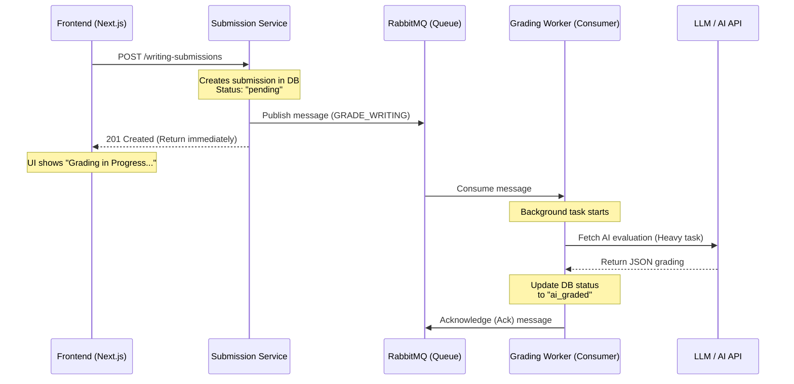
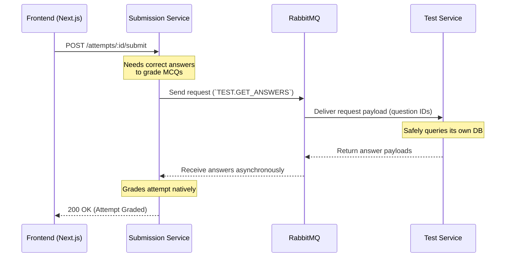
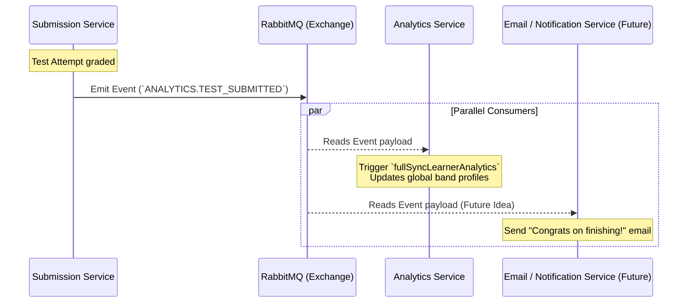

# Message Broker Architecture & Workflows

This document outlines the asynchronous and synchronous event-driven communication flows currently established in the platform using RabbitMQ. By transitioning to a Message Broker, we have decoupled services, improved fault tolerance, and shifted heavy processing (like AI grading) to the background.

## 1. The Asynchronous Task Queue Pattern (AI Grading)
When a learner finishes a Writing or Speaking task, the system doesn't make them wait minutes for the AI to return a score. Instead, it offloads the work to a background queue.

**Benefits:**
* The UI never hangs or times out.
* If the AI service is down, the message stays in the queue and will be processed once the connection restores.

---

## 2. The Remote Procedure Call (RPC) Pattern (Decoupling Monolith)
Before this migration, the Submission Service directly queried tables owned by the Test Service. Now, it queries the Test Service over the Message Broker using an RPC (Request-Reply) pattern.

**Benefits:**
* Eliminates the "Distributed Monolith" anti-pattern. Services no longer cross database limits boundary-lines without permission.
* If the `test-service` crashes, the payload isn't permanently dropped; the submission-service elegantly waits.

---

## 3. The Pub/Sub Event Pattern (Analytics Updates)
When a test is scored, multiple things need to update globally. The Submission service simply drops an event, and any interested service (like Analytics) picks it up.

**Benefits:**
* The Submission Service finishes its operation instantly and doesn't care if Analytics is slow, broken, or down.
* New services can be added easily. If a new "Gamification Service" needs to give the user XP points for finishing a test, it just hooks into `ANALYTICS.TEST_SUBMITTED` without requiring a single code change in the `submission-service`.
